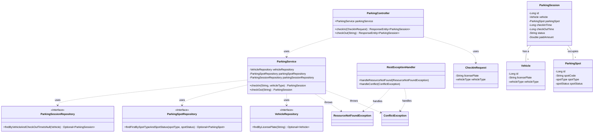

# Parking Lot System

A simple RESTful API for managing a parking lot system, built with Spring Boot, Spring Data JPA (Hibernate), and MySQL.

## Features

*   Check-in a vehicle and assign it an appropriate, available parking spot.
*   Check-out a vehicle, calculate fees, and free up the parking spot.
*   Handles different vehicle types (`MOTORCYCLE`, `CAR`, `SUV`, `TRUCK`) and corresponding spot types.
*   Robust, centralized error handling for common scenarios (e.g., lot full, vehicle already parked, resource not found).
*   Unit-tested service layer using JUnit 5 and Mockito.

## Prerequisites

*   Java 17 or later
*   Gradle 8.x
*   MySQL Server

## Setup & Running the Application

### 1. Database Setup

Before running the application, you need to create a database in your local MySQL instance. You can do this with the following SQL command:

```sql
CREATE DATABASE parking_lot_system;
```

Alternatively, you can modify the datasource URL in `application.properties` to include `createDatabaseIfNotExist=true`.

### 2. Application Configuration

Open the `src/main/resources/application.properties` file and update the database credentials to match your local MySQL setup.

```properties
spring.datasource.username=your_mysql_username
spring.datasource.password=your_mysql_password
```

The application is configured with `spring.jpa.hibernate.ddl-auto=update`, so Hibernate will automatically create the necessary tables when the application starts for the first time.

### 3. Build and Run

You can build and run the application using the provided Gradle wrapper.

From the root directory of the project, run:

```bash
# For Windows
./gradlew.bat bootRun

# For macOS/Linux
./gradlew bootRun
```

The application will start and be accessible at `http://localhost:8080/api/v1`.

## API Endpoints

The base path for all endpoints is `/api/v1`.

### 1. Check-In a Vehicle

Assigns an available parking spot to a vehicle.

*   **URL:** `/parking/check-in`
*   **Method:** `POST`
*   **Request Body:**

    ```json
    {
      "licensePlate": "XYZ-789",
      "vehicleType": "CAR"
    }
    ```

*   **Success Response (201 Created):**

    ```json
    {
        "id": 1,
        "vehicle": { "id": 1, "licensePlate": "XYZ-789", "vehicleType": "CAR" },
        "parkingSpot": { "id": 1, "spotCode": "R-01", "spotType": "REGULAR", "spotStatus": "OCCUPIED" },
        "checkInTime": 1672531200000,
        "checkOutTime": null,
        "status": "ACTIVE",
        "paidAmount": null
    }
    ```

*   **Error Response (409 Conflict):**

    ```json
    {
        "timestamp": "2025-10-28T10:30:00.123456",
        "status": 409,
        "error": "Conflict",
        "message": "Vehicle with license plate XYZ-789 is already parked."
    }
    ```

### 2. Check-Out a Vehicle

Completes a parking session for a vehicle and frees its spot.

*   **URL:** `/parking/check-out/{licensePlate}`
*   **Method:** `POST`
*   **URL Parameter:** `licensePlate` (e.g., `XYZ-789`)

*   **Success Response (200 OK):**

    ```json
    {
        "id": 1,
        "vehicle": { "id": 1, "licensePlate": "XYZ-789", "vehicleType": "CAR" },
        "parkingSpot": { "id": 1, "spotCode": "R-01", "spotType": "REGULAR", "spotStatus": "AVAILABLE" },
        "checkInTime": 1672531200000,
        "checkOutTime": 1672534800000,
        "status": "COMPLETED",
        "paidAmount": 10.0
    }
    ```

*   **Error Response (404 Not Found):**

    ```json
    {
        "timestamp": "2025-10-28T10:35:00.654321",
        "status": 404,
        "error": "Not Found",
        "message": "No active parking session found for vehicle with license plate NON-EXIST."
    }
    ```

## Class Diagram



This `README.md` provides a solid starting point for anyone looking to understand, set up, and use your project.

<!--
[PROMPT_SUGGESTION]Now, let's implement the logic for calculating parking fees during check-out.[/PROMPT_SUGGESTION]
[PROMPT_SUGGESTION]How can I add integration tests for my REST controller endpoints?[/PROMPT_SUGGESTION]
